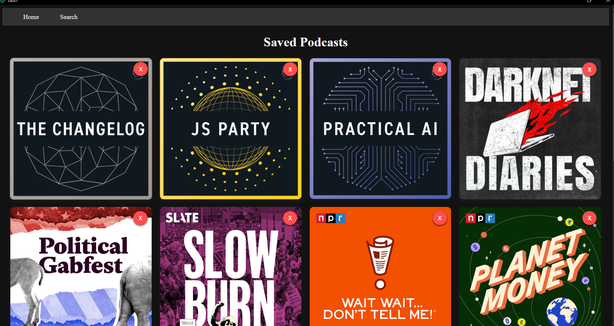
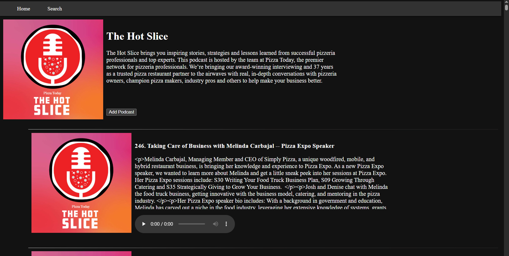

# Project Description
For a while now I have wanted to build a native Windows application. I have tried multiple different frameworks and this project is the result of me experimenting with the Tauri framework: https://v2.tauri.app/.
To keep it simple I decided to create an application for searching for, listening to, and downloading podcasts using RSS feeds. 

## Project Architecture
Frontend was created using Svelte framework while the backends for the project is written in Rust.\
https://svelte.dev/

## Installing Project

Clone this Git Repository and then navigate to the main folder and then run 'npm run dev' from the commandline. Next run 'npm run tauri dev' from the commandline to start the application.

## Project Screenshots
### Home Page

### Search Page

### Podcast Page

